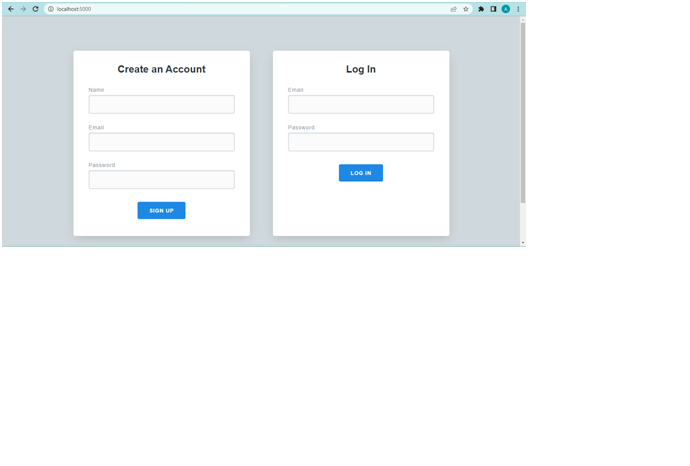
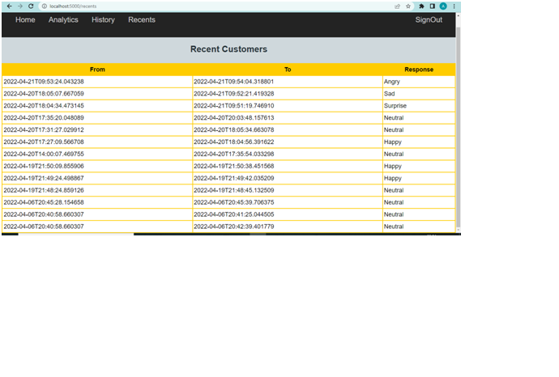
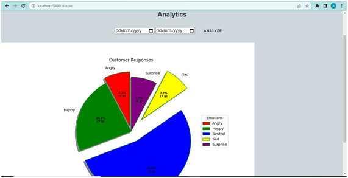
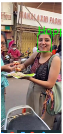

# EMO-SENSE  
**A WebApp for Restaurant Owners to take feedback from customers through their Facial Emotion**  

# Environment Setup  

Download **Python and Flask** [latest version]  

Download **Facial Recognition** Library in your virtual environment

Install other Libraries like **OpenCV,CVLIB,numpy,matplot,keras,tensorflow**  

**Now your System is Environment Ready.**  

# System Working  

** For Facial Emotion Recognition we are using the MobileNet Model for computation of the facial emotion **  

Model at [EmotionRecognition.h5](/model/Emotion_Detection.h5)  

# Screenshots  

**Login Page**  

  

**Check Response for Recent Customers**  

  

**Analytics Page for Customers**

  

**Camera Demo Sample**  

